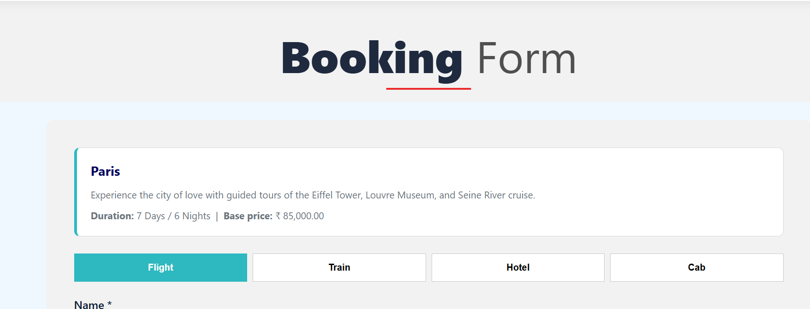
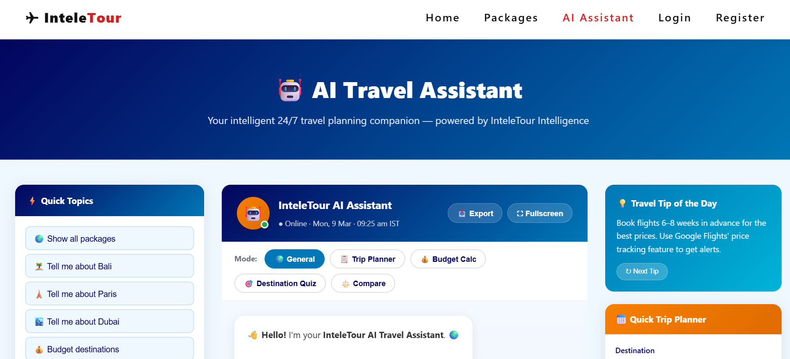
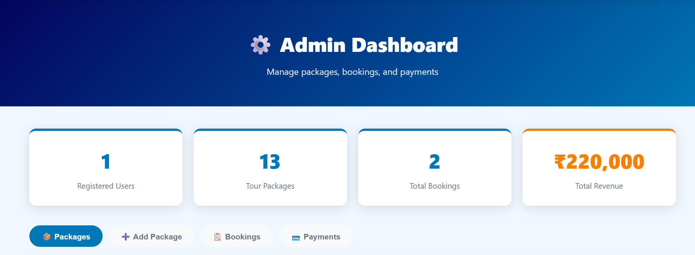

# InteleTour - AI-Powered Tour Booking System

InteleTour is a PHP and MySQL based travel booking platform for browsing tour packages, registering users, creating bookings, completing payments, managing trips, and administering package data. The project also includes a built-in AI-style travel assistant with destination suggestions, package comparisons, budget guidance, and trip-planning features.

## GitHub Description

AI-powered tour booking system built with PHP and MySQL, featuring package browsing, secure bookings, payments, admin management, and a smart travel assistant.

## GitHub Topics

`php`, `mysql`, `tour-booking-system`, `travel-booking`, `travel-website`, `booking-system`, `ai-assistant`, `chatbot`, `admin-dashboard`, `user-authentication`, `payment-integration`, `xampp`

## Overview

This project is designed as a complete travel booking website with:

- Public landing page with featured destinations and travel sections
- User registration and login
- Package browsing with search, filter, sort, wishlist, and compare UI
- Booking flow for flight, train, hotel, and cab services
- Payment confirmation with transaction ID generation
- Booking history page for logged-in users
- Admin dashboard to manage packages, bookings, and payments
- AI travel assistant with chat history and smart travel guidance

## Features

### User Features

- Create an account with username, email, password, mobile, and address
- Login using username or email
- Browse available packages from the database
- Filter packages by region, budget, and sort order
- Search packages by destination or description
- Book packages with multiple service types:
  - Flight
  - Train
  - Hotel
  - Cab
- Auto-calculated total booking price based on traveler count
- Complete payment using:
  - Credit Card
  - Debit Card
  - UPI
  - Net Banking
- View booking history and payment status
- Access AI travel assistant for destination help and travel recommendations

### Admin Features

- Admin login from the same login page
- View platform statistics:
  - Registered users
  - Total packages
  - Total bookings
  - Total revenue
- Add new tour packages
- Delete packages
- Update booking status
- View completed payment records

### AI Assistant Features

The AI assistant is implemented inside [`ai_assistant.php`](/d:/xampp/htdocs/TourBookingSystem/ai_assistant.php) and includes:

- Chat interface with persistent session-based chat history
- Destination knowledge base
- Package recommendation logic
- Trip planner
- Budget calculator
- Destination quiz
- Weather and travel tips style responses
- Auto-suggestions while typing
- Export chat option
- Fullscreen mode
- Copy-on-double-click for messages

## Tech Stack

- Frontend: HTML, CSS, JavaScript
- Backend: PHP
- Database: MySQL
- Local Server: XAMPP
- Session Handling: Native PHP sessions

## Project Structure

```text
TourBookingSystem/
├── admin.php
├── ai_assistant.php
├── booking.php
├── database.php
├── index.php
├── intele_tour.sql
├── login.php
├── logout.php
├── my_bookings.php
├── packages.php
├── payment.php
├── register.php
├── script.js
├── style.css
├── .env
├── images/
└── screenshots/
```

## Pages and Modules

### [`index.php`](/d:/xampp/htdocs/TourBookingSystem/index.php)

- Homepage
- Featured packages
- Gallery
- Testimonials
- FAQ
- Newsletter and contact form UI

### [`packages.php`](/d:/xampp/htdocs/TourBookingSystem/packages.php)

- Lists all packages
- Supports filtering, sorting, and searching
- Adds extra package records if they do not already exist in the database
- Includes wishlist and compare UI

### [`booking.php`](/d:/xampp/htdocs/TourBookingSystem/booking.php)

- Booking form for selected package
- Supports flight, train, hotel, and cab booking flows
- Validates dates and traveler count
- Creates booking and redirects to payment

### [`payment.php`](/d:/xampp/htdocs/TourBookingSystem/payment.php)

- Completes payment for a booking
- Generates a unique transaction ID
- Marks payment as completed
- Updates booking status to confirmed

### [`my_bookings.php`](/d:/xampp/htdocs/TourBookingSystem/my_bookings.php)

- Shows a logged-in user all bookings
- Displays payment status and transaction ID

### [`login.php`](/d:/xampp/htdocs/TourBookingSystem/login.php)

- User login
- Admin login

### [`register.php`](/d:/xampp/htdocs/TourBookingSystem/register.php)

- New user registration
- Password hashing using `password_hash`

### [`admin.php`](/d:/xampp/htdocs/TourBookingSystem/admin.php)

- Admin dashboard for package, booking, and payment management

### [`database.php`](/d:/xampp/htdocs/TourBookingSystem/database.php)

- MySQL database connection
- Common helper functions:
  - `clean()`
  - `redirect()`
  - `isLoggedIn()`
  - `isAdmin()`
  - `packageImageUrl()`

## Database Schema

The database file is [`intele_tour.sql`](/d:/xampp/htdocs/TourBookingSystem/intele_tour.sql).

### Tables

- `users`
- `packages`
- `bookings`
- `payments`
- `admins`
- `chat_history` is auto-created by [`ai_assistant.php`](/d:/xampp/htdocs/TourBookingSystem/ai_assistant.php) if it does not already exist

### Seed Data

The SQL file inserts:

- Sample packages:
  - Paris
  - Tokyo
  - Bali
  - Dubai
- Default admin record

## Default Admin Credentials

The project currently allows admin access with:

- Username: `admin`
- Password: `admin123`

Important: This is suitable only for local/demo use. Change it before any real deployment.

## Installation and Setup

### 1. Clone or copy the project

Place the project in your XAMPP `htdocs` directory:

```text
d:\xampp\htdocs\TourBookingSystem
```

### 2. Start Apache and MySQL

Use the XAMPP Control Panel and start:

- Apache
- MySQL

### 3. Create the database

Open phpMyAdmin or MySQL and import:

[`intele_tour.sql`](/d:/xampp/htdocs/TourBookingSystem/intele_tour.sql)

This creates:

- `intele_tour` database
- Required tables
- Sample package data
- Default admin

### 4. Check database connection

The current database config is in [`database.php`](/d:/xampp/htdocs/TourBookingSystem/database.php):

```php
define('DB_HOST', 'localhost');
define('DB_USER', 'root');
define('DB_PASS', '');
define('DB_NAME', 'intele_tour');
```

Update it if your local MySQL configuration is different.

### 5. Open the project

Visit:

```text
http://localhost/TourBookingSystem/
```

## Environment Variables

The repository contains a [`.env`](/d:/xampp/htdocs/TourBookingSystem/.env) file with OpenAI-related variables:

- `OPENAI_API_KEY`
- `OPENAI_MODEL`

At the moment, the PHP code in this repository does not directly read those values, so they appear to be reserved for future integration or external tooling.

Security note:

- A real API key should never be committed to GitHub.
- Rotate the existing key immediately if it is still active.
- Replace it with your own local secret file or create a `.env.example` without secrets before publishing the repository.

Suggested `.env.example`:

```env
OPENAI_API_KEY=your_openai_api_key_here
OPENAI_MODEL=gpt-4o-mini
```

## Booking Flow

1. User registers an account
2. User logs in
3. User opens the packages page
4. User selects a package
5. User fills the booking form
6. Booking is created with `pending` status
7. User completes payment
8. Payment is stored with a generated transaction ID
9. Booking is updated to `confirmed`
10. User can review the trip in `My Bookings`

## Validation and Security Notes

Current implementation includes:

- Password hashing for user accounts
- Prepared statements in several important flows
- Session-based access control for user and admin pages
- Input validation for email, password length, dates, and traveler counts

Current limitations to be aware of:

- Admin login uses a hardcoded password path in [`login.php`](/d:/xampp/htdocs/TourBookingSystem/login.php)
- Some admin update/delete queries still use interpolated SQL
- The `.env` file currently contains a real secret and should not be committed
- Payment processing is simulated, not connected to a live gateway
- AI assistant behavior is rule/knowledge-base driven, not a live LLM integration in the checked-in code

## Screenshots

The project already includes screenshots in the [`screenshots`](/d:/xampp/htdocs/TourBookingSystem/screenshots) folder.

### Home Page


### Gallery Section


### Booking Page



### AI Assistant



### Admin Dashboard



## Known Limitations

- No real payment gateway integration
- No email confirmation system
- No password reset flow
- No role-based admin management beyond the current single-admin approach
- No production deployment configuration
- Some UI text contains encoding artifacts and can be cleaned up

## Future Improvements

- Integrate a real payment gateway
- Move admin authentication fully into the database with hashed password checks
- Add package image upload support
- Add booking cancellation from the user dashboard
- Add email notifications
- Add proper `.env` loading in PHP
- Add CSRF protection
- Add PHPUnit or integration testing
- Add Docker setup
- Add responsive menu improvements for mobile

## Repository Metadata

### Suggested Repository Name

`TourBookingSystem`

### Suggested Short Description

AI-powered tour booking system built with PHP and MySQL, featuring package browsing, secure bookings, payments, admin management, and a smart travel assistant.

### Suggested Topics

`php`, `mysql`, `tour-booking-system`, `travel-booking`, `travel-website`, `booking-system`, `ai-assistant`, `chatbot`, `admin-dashboard`, `xampp`

## License

No license file is currently included in the repository. If you plan to publish this project, add a license such as MIT.

## Author

Built as an InteleTour travel booking platform project using PHP, MySQL, HTML, CSS, and JavaScript.
